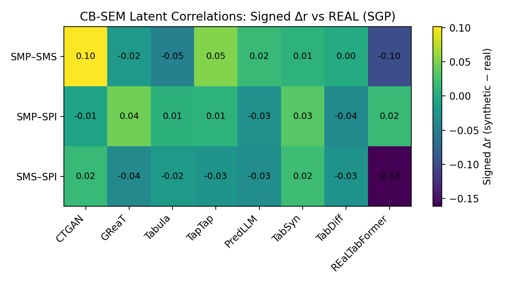
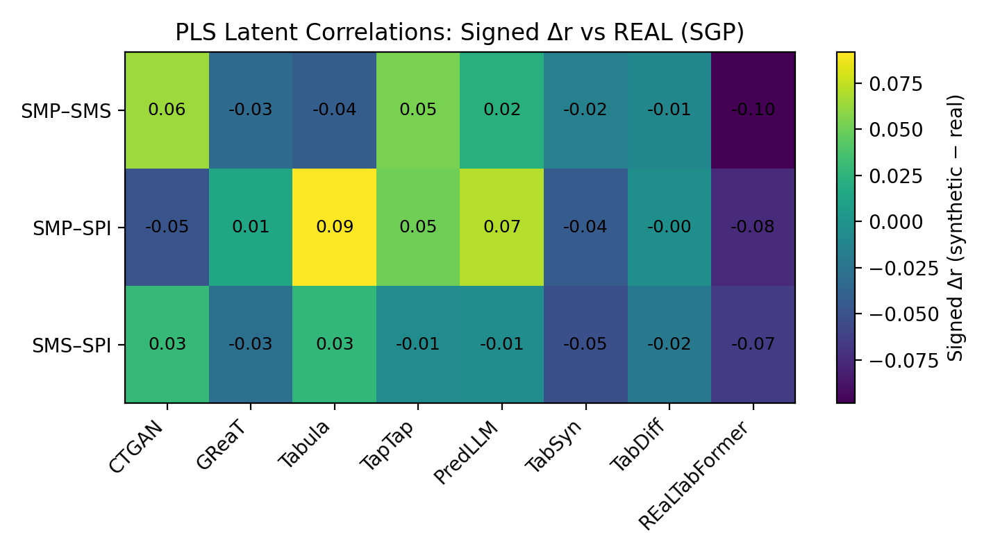
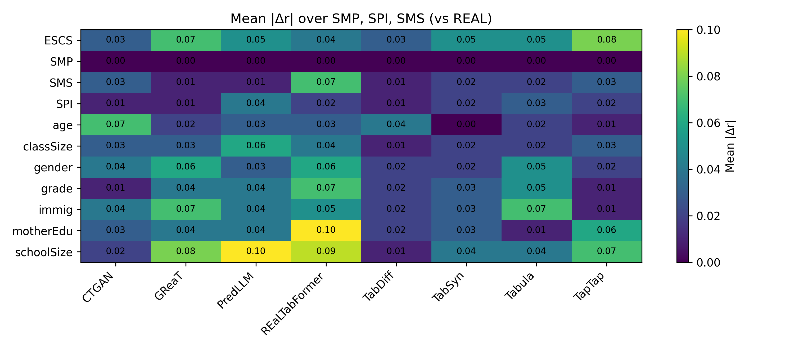
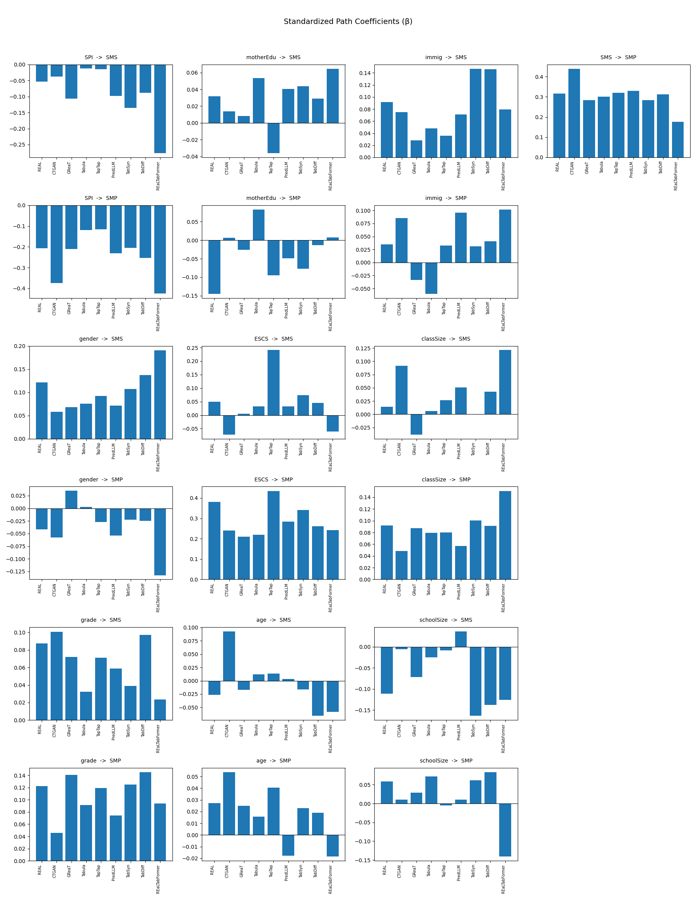
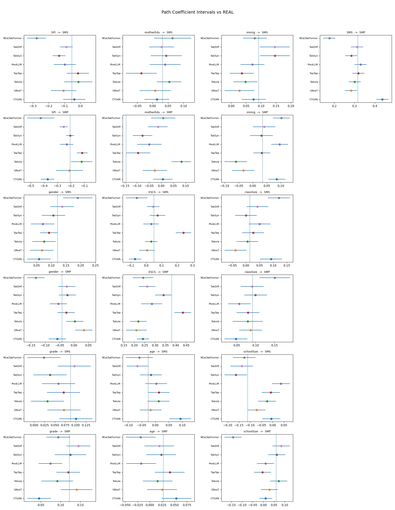
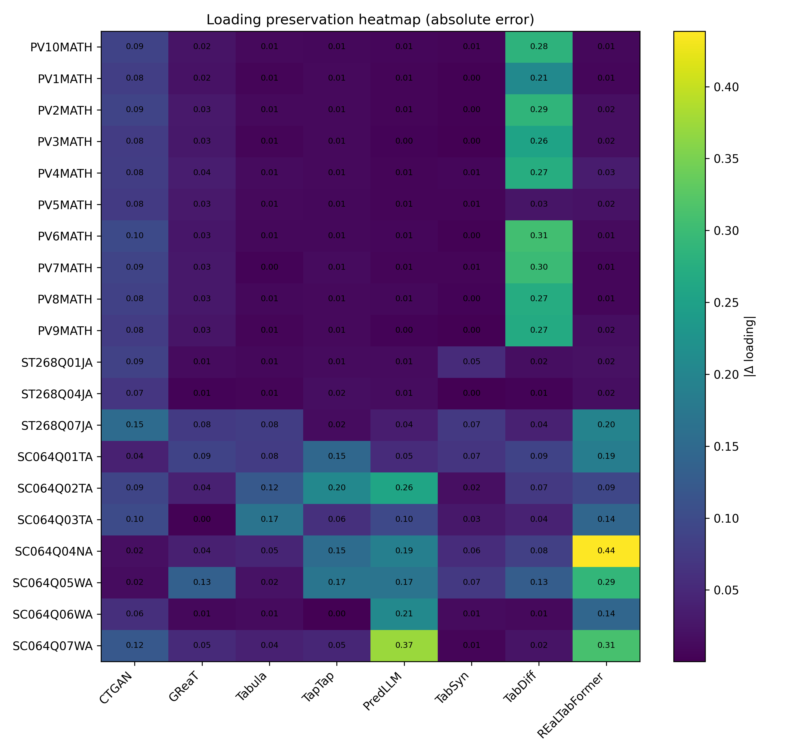
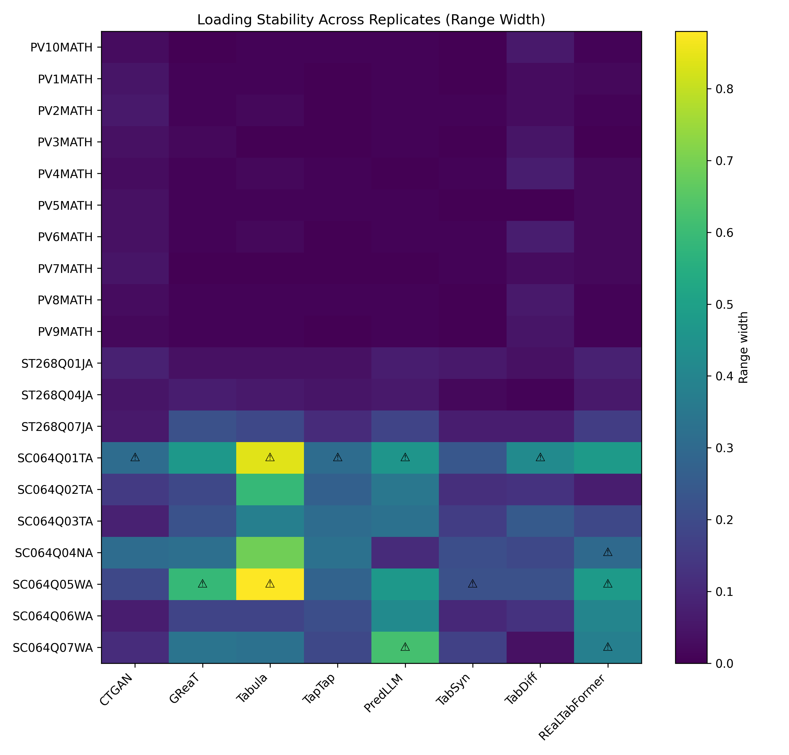
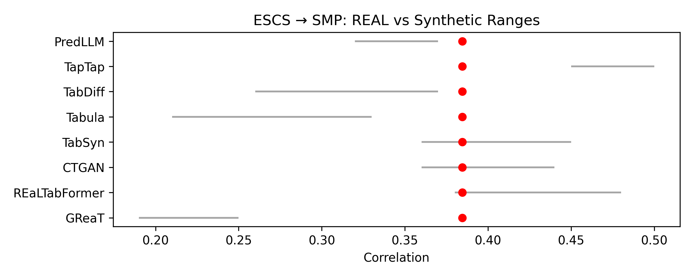
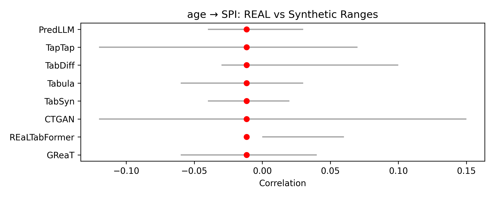

BENCHMARKING SYNTHETIC TABULAR DATA GENERATORS FOR STRUCTURAL COHERENCE OF BEHAVIORAL AND EDUCATIONAL DATASETS
DOI

📌 Overview
Synthetic tabular data is increasingly used to enable data sharing in privacy-sensitive behavioral and educational research contexts. However, its suitability for Structural Equation Modeling (SEM) remains to be fully understood. This study benchmarks LLM-based and diffusion-based synthetic data generators for their ability to preserve structural coherence—including measurement properties, causal path directions, and global model fit—required for valid SEM-based analysis.

Using data from PISA 2022 and TIMSS 2023 (Singapore samples), this work evaluates generators across distributional fidelity, measurement reliability, discriminant validity, structural path preservation, global model fit, and privacy risk.

🔬 Key Findings
Finding	Details
Diffusion models excel	TabDiff and TabSyn achieve strong preservation of structural relationships and global SEM fit
LLM sensitivity	LLM-based generators exhibit greater sensitivity to model size and hyperparameter configuration
Privacy trade-offs	In small-sample settings, certain diffusion models show substantial privacy leakage; well-tuned LLMs demonstrate more balanced performance
Model capacity matters	Increasing LLM model capacity (GReaT-Lrg) substantially improves measurement fidelity, rivaling diffusion-based approaches

📊 TIMSS 2023 (Singapore) - Full Benchmark Results
Metric	TabDiff	TabSyn	GReaT	PredLLM	TapTap	REaLTabFormer	CTGAN	Tabula
— DISTRIBUTION FIDELITY —								
Mean |Δμ| ↓	0.030	0.080	0.110	0.080	0.060	0.300	0.250	1.330
Mean |Δσ| ↓	0.030	0.050	0.010	0.030	0.120	0.050	0.030	0.300
Continuous adherence ↑	1.000	1.000	1.000	0.852	0.994	0.923	1.000	0.758
Category adherence ↑	1.000	1.000	1.000	0.000	0.000	0.000	1.000	1.000
Composite error ↓	0.060	0.130	0.120	1.258	1.186	1.427	0.280	1.872
Distribution composite ↑	0.997	0.961	1.000	0.436	0.535	0.455	0.940	0.000
Distribution rank	2	3	1	7	5	6	4	8
— STRUCTURAL FIDELITY —								
Directional consistency ↑	1.000	1.000	1.000	1.000	1.000	0.750	1.000	0.750
Rank preservation (Spearman ρ) ↑	1.000	1.000	1.000	0.600	0.800	0.400	-0.200	1.000
Latent corr |Δr| ↓	0.057	0.030	0.058	0.058	0.120	0.180	0.216	0.235
Covariate |Δr| ↓	0.020	0.021	0.053	0.040	0.071	0.044	0.061	0.162
Structural composite ↑	0.717	0.748	0.659	0.625	0.521	0.274	0.283	0.083
Structural rank	2	1	3	4	5	7	6	8
— MEASUREMENT FIDELITY —								
Loading MAD ↓	0.097	0.016	0.026	0.014	0.092	0.289	0.259	0.378
Reliability MAD ↓	0.508	0.371	0.177	0.429	0.336	0.174	1.058	1.131
Measurement composite ↑	0.711	0.895	0.983	0.867	0.809	0.623	0.202	0.000
Measurement rank	5	2	1	3	4	6	7	8
— VALIDITY —								
HTMT RMSE ↓	0.035	0.040	0.070	0.069	0.141	0.091	0.172	0.070
CFI ↑	0.960	0.910	0.930	0.960	0.930	0.820	0.920	0.920
TLI ↑	0.950	0.890	0.910	0.950	0.920	0.790	0.910	0.910
RMSEA ↓	0.040	0.070	0.070	0.050	0.070	0.110	0.060	0.060
SRMR ↓	0.050	0.060	0.060	0.050	0.060	0.090	0.060	0.070
Validity composite ↑	1.000	0.805	0.729	0.858	0.478	0.296	0.366	0.707
Validity rank	1	3	4	2	6	8	7	5
— PRIVACY —								
Exact Match Rate ↓	0.000	0.143	0.065	0.000	0.000	0.000	0.000	0.000
NNDR ↑	2.623	1.277	1.622	2.310	2.172	2.334	2.832	4.046
Membership inference risk ↓	0.762	0.891	0.937	0.848	0.856	0.840	0.751	0.442
DCR p05 ↑	1.742	0.000	0.283	1.463	1.277	1.300	1.861	1.755
Privacy composite ↑	0.697	0.000	0.189	0.583	0.540	0.567	0.739	1.000
Privacy rank	3	8	7	4	6	5	2	1
— OVERALL —								
Composite score ↑	1.000	0.833	0.827	0.795	0.537	0.180	0.166	0.000
Overall rank	1	2	3	4	5	6	7	8
Note: ↓ indicates lower is better. ↑ indicates higher is better.

📊 Generators Benchmarked
Category	Generators
Diffusion-based	TabDiff, TabSyn
LLM-based	GReaT, PredLLM, TapTap, REaLTabFormer, TabuLa
Classical	CTGAN

🛠️ Tech Stack
Category	Technologies
Languages	Python, R
Deep Learning	PyTorch, HuggingFace Transformers
Generation Models	TabSyn, TabDiff, GReaT, PredLLM, TapTap, REaLTabFormer, TabuLa, CTGAN
SEM Evaluation	SEMinR (PLS-SEM), lavaan (CB-SEM)
Infrastructure	Slurm, NeSI HPC, Raapoi Cluster
Documentation	LaTeX

📊 End-to-End Evaluation Pipeline
This repository implements a fully automated SEM-oriented evaluation pipeline:

Auto-preprocessing — PISA 2022 and TIMSS 2023 datasets
Generator Training — LLM fine-tuning + diffusion model training on HPC cluster
Structural Evaluation — SEM fit indices (CFI, TLI, RMSEA, SRMR), directional consistency, rank preservation, measurement reliability, discriminant validity (HTMT)
Privacy Assessment — Exact match rate, nearest-neighbor distance ratio (NNDR), membership inference risk, distance to closest record (DCR)
Automated Reporting — Tabular reports + data visualization outputs

📈 Output Visualizations

All figures and interactive tables referenced below are in the [`Outputs/`](./Outputs) folder of this repo. Static `.png` figures render directly below; interactive `.html` reports are linked (GitHub renders HTML as source code, not as a live page — see note at the bottom).

### Interactive Reports (HTML)

These are best viewed live via GitHub Pages rather than opened as raw source on GitHub. Once Pages is enabled for this repo (see note below), each link will render as an interactive table/chart:

**Summary Tables**
- [Final ranking](./Outputs/table_00b_final_ranking_detailed_metric_breakdown.html)
- [Boundary adherence](./Outputs/table_boundary_adherence.html)
- [Boundary adherence — diff vs real](./Outputs/table_boundary_adherence_diff_vs_real.html)
- [Category adherence](./Outputs/table_category_adherence.html)
- [Continuous summary](./Outputs/table_continuous_summary.html)
- [Covariate correlation error](./Outputs/table_covariate_corr_error.html)
- [Covariate correlation ranges](./Outputs/table_covariate_corr_ranges.html)
- [Discriminant margin](./Outputs/table_discriminant_margin.html)
- [Distribution summary — categorical](./Outputs/table_distribution_summary_categorical.html)
- [Distribution summary — continuous](./Outputs/table_distribution_summary_continuous.html)
- [Fornell-Larcker / HTMT RMSE](./Outputs/table_fl_htmt_rmse.html)
- [Fornell-Larcker diagonal](./Outputs/table_fornell_larcker_diag.html)
- [HTMT stability](./Outputs/table_htmt_stability.html)
- [HTMT summary](./Outputs/table_htmt_summary.html)
- [Indirect effects comparison](./Outputs/table_indirect_effects_comparison.html)
- [Latent correlation stability](./Outputs/table_latent_correlation_stability.html)
- [Missingness diagnostics](./Outputs/table_missingness_diagnostics.html)
- [Range sanity vs real](./Outputs/table_range_sanity_vs_real.html)
- [Sample size](./Outputs/table_sample_size.html)

**Global Model Fit (CB-SEM)**
- [Global fit — mean](./Outputs/cbsem_global_fit_mean.html)
- [Global fit — stability](./Outputs/cbsem_global_fit_stability.html)
- [R² summary](./Outputs/cbsem_r2_summary.html)

**Measurement / Loadings**
- [Loading delta matrix](./Outputs/loading_delta_matrix.html)
- [Loading range width](./Outputs/loading_range_width.html)
- [Loading sign flip](./Outputs/loading_sign_flip.html)
- [Mean absolute loading error](./Outputs/mean_absolute_loading_error.html)

**Structural Paths**
- [Path direction rank summary](./Outputs/path_direction_rank_summary.html)
- [Path range overlap](./Outputs/path_range_overlap.html)
- [Standardized path betas](./Outputs/standardized_path_betas.html)

**Reliability**
- [Reliability — MAD vs real](./Outputs/reliability_mad_vs_real.html)
- [Reliability — stability](./Outputs/reliability_stability.html)
- [Reliability — thresholds](./Outputs/reliability_thresholds.html)

**Privacy**
- [Privacy — k-anonymity mean](./Outputs/privacy_k_anonymity_mean.html)
- [Privacy — mean](./Outputs/privacy_mean.html)

> **Note:** GitHub does not render `.html` files inline — clicking a link above shows the raw source code. To view these as live, interactive pages, enable **GitHub Pages** for this repo (Settings → Pages → Deploy from branch → `main` → `/root`), then replace the relative links above with `https://mithunthakkar8.github.io/Summer-Scholarship-Project/Outputs/<filename>.html`.

### Structural Fidelity

Heatmaps comparing latent and observed correlation deltas between real and synthetic data (CB-SEM and PLS-SEM):

Standardized structural path comparisons across all generators:

### Measurement Fidelity

Factor loading deltas and reliability ranges across generators:

### Covariate Stability (Interval Dot Plots)

To check whether relationships between key covariates (ESCS, age, class size, gender, grade, immigration status, mother's education, school size) and the latent outcomes (SMP, SMS, SPI) hold up under synthetic generation, interval dot plots were produced for every covariate × outcome pair (27 total). Two representative examples:

The full set of 27 covariate plots (all combinations of ESCS, age, class size, gender, grade, immigration status, mother's education, school size × SMP/SMS/SPI) is available in [`Outputs/`](./Outputs).

📄 License
This project is licensed under the GNU General Public License v3.0. See the LICENSE file for details.

For questions, collaborations, or code access:

mithun.thakkar8@gmail.com

Associated Paper: arXiv preprint (forthcoming)

Note: This work represents pioneering results at the intersection of generative AI and Structural Equation Modeling. If you build upon this work, please maintain the citation and license terms.

📝 Citation
If you use this software or build upon these methods in your research, please cite:

Mithun Thakkar, "Benchmarking Synthetic Tabular Data Generators for Structural Coherence of Behavioral and Educational Datasets", arXiv preprint, 2026

@software{Thakkar_Benchmarking_Synthetic_Tabular_2026,
  author = {Mithun Thakkar},
  title = {Benchmarking Synthetic Tabular Data Generators for Structural Coherence of Behavioral and Educational Datasets},
  url = {https://github.com/mithunthakkar8/Summer-Scholarship-Project},
  doi = {10.5281/zenodo.19759033},
  version = {1.0.0},
  year = {2026}
}

The content is under active validation and should not be considered a finalized or peer-reviewed academic work.

